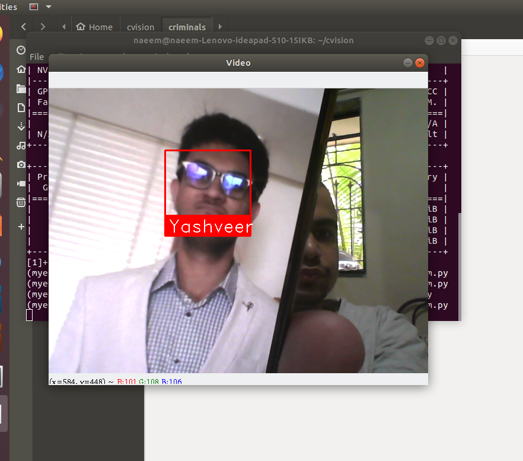
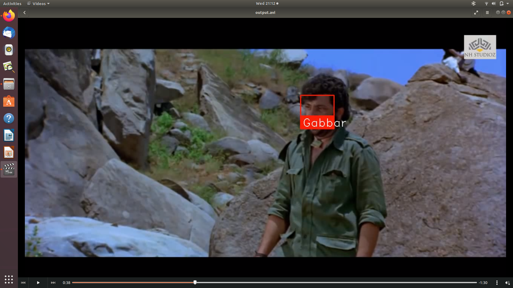
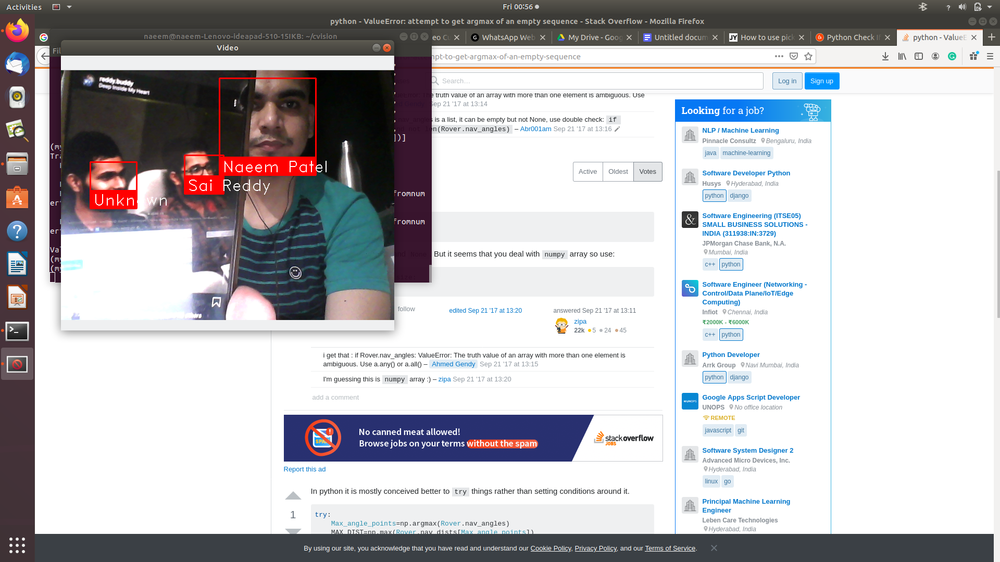

## Introduction
This project was developed as a prototype for detecting criminal using the facenet architecture. This consist of a number of utilities written majorly in python and a single bash script

## Usage


#### Scripts
This folder consist of automation tools for activating the environment if any and also to create a dataset. 

```bash
bash automate.sh
```


### src
This is the bread and the butter of the project. Consist of detection using webcam and also for videos. It also comprises of an experimental detection by using an SVM classifier

```bash
python webcam.py
```

## Model
This consist of the training model that is SVM model and the embeddings of the images to be used for detection


## Results

#### Detection result on single Person


#### Detection result on videos of Gabbar


#### Detection result on multiple people



## Contributing
Pull requests are welcome. For major changes, please open an issue first to discuss what you would like to change.

Please make sure to update tests as appropriate.

## License
[MIT](https://choosealicense.com/licenses/mit/)
